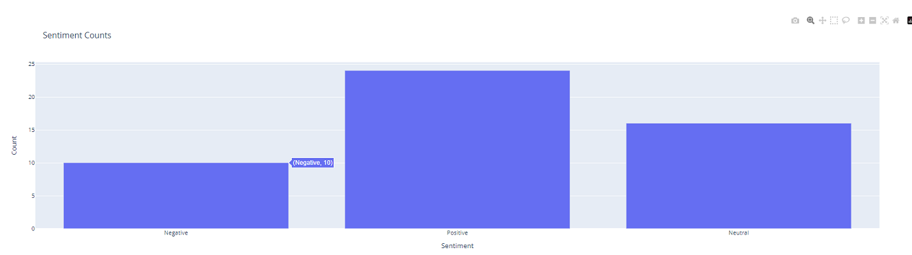
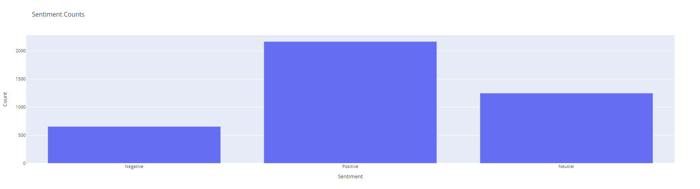

---
# Lab 04: Streaming Data Processing with Spark


## Get Twitter tweets

- Our team chose option 2: Storing in a database for enriching incoming data points with MongoDB.
- Download dataset and save with name `tweets.parquet`
       
```bash
    !wget -q
        https://huggingface.co/datasets/deberain/ChatGPT-Tweets/resolve/main/data/train-00000-of-00001-c77acc9ef8da1d50.parquet
        -O tweets.parquet
```
- Storing structure:
    - **'Date'**: The date and time when the tweet was posted.
    - **'Tweet'**: The content of the tweet.
    - **'Url'**: The URL link within the tweet.
    - **'User'**: The username of the user who posted the tweet.
    - **'UserCreated'**: The date and time when the user created their Twitter account.
    - **'UserVerified'**: The verification status of the user on Twitter.
    - **'UserFollowers'**: The number of followers of the user. 
    - **'UserFriends'**: The number of friends of the user.
    - **'Retweets'**: The number of retweets of the tweet.
    - **'Likes'**: The number of likes of the tweet.
    - **'Location'**: The location specified by the user in their profile information.
    - **'UserDescription'**: The description of the user in their profile information.
- Numbers of batch : 5000

## Stream tweets to Apache Spark
- Set up Apache Kafka's producer:
    - Connect to MongoDB on the local machine using API MongoDB.
    - Retrieve data from the 'input_data' database.
    - Create a KafkaProducer object to send messages to Kafka.
    - Retrieve each document, convert it to the JSON format and then send the message to the topic.
   
- Create topic `reco-train`

```bash
!./kafka_2.13-2.8.2/bin/kafka-topics.sh 
    --create --bootstrap-server 127.0.0.1:9092 
    --replication-factor 1 
    --partitions 1 
    --topic reco-train
```

- Set up Apache Kafka's consumer 
    - setup consumer receive messages with 2 topics reco train and test train
```python
consumer = KafkaConsumer(
    'reco-train',
    bootstrap_servers='localhost:9092',
    group_id='test-group',
    auto_offset_reset='earliest'
)
```

- Using streaming spark to capture packets sent from producer to consumer
```python
spark = SparkSession.builder \
        .appName("StreamingExample") \
        .master("local[*]") \
        .config(
            "spark.jars.packages",
            "org.apache.spark:spark-sql-kafka-0-10_2.12:3.1.1"
        )\
        .config("spark.driver.memory", "2g") \
        .getOrCreate()
    kafka_topic_name = "reco-train"
    kafka_bootstrap_servers = 'localhost:9092'

    schema = StructType().add("Date", StringType()).add("Tweet", StringType())


    df = spark.readStream.format("kafka") \
        .option("kafka.bootstrap.servers", kafka_bootstrap_servers) \
        .option("subscribe", kafka_topic_name) \
        .option(
            "value.deserializer",             
            "org.apache.kafka.common.serialization.StringDeserializer"
        ) \
        .load()
```

## Perform sentiment analysis on tweets
- Our team has decided to use the NLTK (Natural Language Toolkit) library for sentiment analysis of tweets. Because, NLTK is a popular library in the field of natural language processing, providing various tools and resources for text analysis.
- NLTK offers the SentimentIntensityAnalyzer class, a pre-trained model for sentiment analysis. This class utilizes the VADER lexicon, which contains words and their corresponding sentiment scores. We can classify tweets into positive, negative, or neutral sentiment labels with VADER.
- The steps to perform sentiment analysis:
    - Using polarity_scores to calculate sentiment scores for the input tweet.
    - Comparing against the thresholds of 0.5 and -0.5.
    - If the sentiment score is greater than or equal to 0.05, the function will return 'Positive'. If the sentiment score is less than or equal to -0.05, the function will return 'Negative'. Otherwise, if the sentiment score is in between, the function will return 'Neutral'.

<center>

<!--  -->
| |
|:-:|
|**Figure 0a: Samples of data after applying sentiment analysis** |

<!--  -->
||
|:-:|
|**Figure 0b: Samples of data after applying sentiment analysis** |

</center>
    
## Visualize the analytic results
- Before visualizing the data, I stored the streaming data in a MongoDB database.
- Our team chooses the **"Using Dynamic Plotting Figure"** option. We creates a dashboard by using the **dash** and **plotly** library. Then, we use ngrok to deploy dashboard on a web-based environment.
- In the case of risk, our team has prepared by adding both option 1 and option 2 as additional measures.
### Some notes on data visualization

<center>
    
<!-- || -->
|  |
|:-:|
|**Figure 1: Dashboard**|

</center>

- First update:
    - Positive: 24.
    - Neural: 16.
    - Negative: 10.


<center>
    
<!-- || -->
| 
|:-:|
|**Figure 2: First update**|
    
</center>


<center>
    
<!-- || -->
| 
|:-:|
|**Figure 3: First update**|
    
</center>

- Second update:
    - Positive: 2164.
    - Neutral: 1247.
    - Negative: 654.

<center>
    
<!-- || -->
| 
|:-:|
|**Figure 4: Second update**|

</center>

<center>
    
<!-- || -->
| 
|:-:|
|**Figure 5: Second update**|
    
</center>

- Third update:
    - Positive: 5191.
    - Neutral: 2965.
    - Negative: 1587. 

<center>
    
<!-- || -->
| 
|:-:|
|**Figure 6: Third update**|

</center>

<center>
    
<!-- || -->
| 
|:-:|
|**Figure 7: Third update**|

</center>

- Fourth update:

    - Positive: 7783.
    - Neutral: 4444.
    - Negative: 2366.

<center>
    
<!-- || -->
| 
|:-:|
|**Figure 8: Fourth update**|

</center>

<center>
    
<!-- || -->
| 
|:-:|
|**Figure 9: Fourth update**|
</center>

- The graph shows the total number of positive and negative comments on twitter:
- Positive comments use the general trend and are higher than other comments.
- Through the graph we can draw:
Neutral comments also account for twice as much as negative comments.
    - Show an overview of user feedback status: The pie chart shows the percentage of positive and negative user feedback, to help us better understand the general feeling of the community on a topic, the event or product on Twitter.
    - Help us assess the importance of feedback: Pie charts can help us determine which feedback is appreciated and which is underrated, thereby helping the company, product or individual. individuals have a better view of the reputation, quality or positive or negative aspects of the product or service they are providing.
    - Help with Decisions: Pie charts can help marketers or administrators make decisions about outreach and response strategies for users, thereby increasing engagement and improving customer satisfaction. client.


## References

- Apache Spark Streaming Tutorial: Identifying Trending Twitter Hashtags - [https://www.toptal.com/apache/apache-spark-streaming-twitter](https://www.toptal.com/apache/apache-spark-streaming-twitter).
- Kafka and Spark Streaming in Colab - [https://colab.research.google.com/github/recohut/notebook/blob/master/_notebooks/2021-06-25-kafka-spark-streaming-colab.ipynb](https://colab.research.google.com/github/recohut/notebook/blob/master/_notebooks/2021-06-25-kafka-spark-streaming-colab.ipynb).
- Monitor Twitter with a hashtag tracker - [https://www.tweetbinder.com/blog/twitter-hashtag-tracker/](https://www.tweetbinder.com/blog/twitter-hashtag-tracker/).
- Alex York - How to analyze Twitter data - [https://sproutsocial.com/insights/twitter-data/](https://sproutsocial.com/insights/twitter-data/)
- Hikmat Ullah Khan, Shumaila Nasir, Kishwar Nasim, Danial Shabbir, Ahsan Mahmood - Twitter trends: A ranking algorithm analysis on real time data - [https://www.sciencedirect.com/science/article/abs/pii/S0957417420307673](https://www.sciencedirect.com/science/article/abs/pii/S0957417420307673).
- PySpark Twitter Streaming + Kafka - [https://sites.google.com/a/ku.th/big-data/pyspart](https://sites.google.com/a/ku.th/big-data/pyspart).
